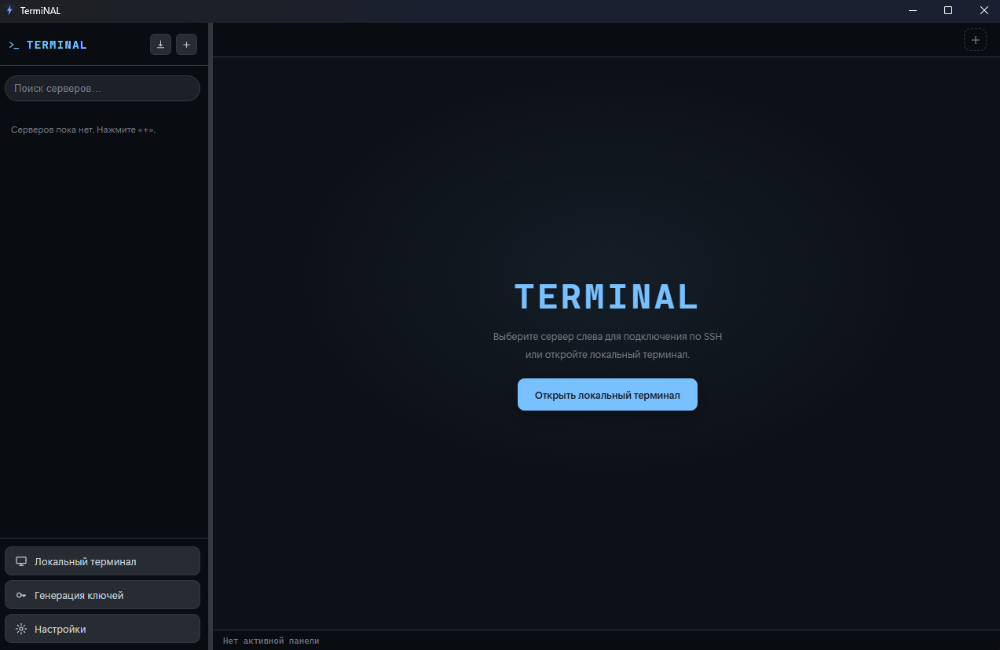

<div align="center">


# TermiNAL

**Десктоп-клиент SSH / SFTP «всё в одном окне».**

Вкладки и сплит-панели, файловый менеджер SFTP со встроенным редактором,
проброс портов, мониторинг ресурсов, панель Docker и локальный терминал —
в установщике на **3 МБ**.

[](https://tauri.app)
[](https://www.rust-lang.org)
[](https://react.dev)
[](https://www.typescriptlang.org)
[](#-лицензия)



</div>

---

## ✨ Почему TermiNAL

Полноценная рабочая станция для серверов, которая не мешает работать — **лёгкая нативно**
благодаря Tauri. Вместо того чтобы тащить с собой целый браузер, интерфейс рендерится в
системном WebView, а вся тяжёлая работа (SSH, SFTP, шифрование, PTY) выполняется в одном
Rust-бинарнике.

| | **TermiNAL (Tauri)** | Типичный Electron-клиент |
| --- | :---: | :---: |
| Размер установщика | **≈ 3 МБ** | ≈ 85 МБ |
| Память в простое | **≈ 33 МБ** | 150–250 МБ |
| SSH-движок | чистый Rust [`russh`](https://github.com/Eugeny/russh) | libssh2 / нативный |
| Рантайм | системный WebView2 | полный Chromium |

---

## 🚀 Возможности

### Терминал и UX
- **Несколько SSH-вкладок** + **сплит-панели** (дерево с перетаскиванием границ, выбор сервера на панель)
- **Локальный терминал** с умным выбором shell (PowerShell → cmd, либо свой / WSL)
- Поиск (`Ctrl+F`), зум, **17 тем на весь интерфейс**, **компактный режим**
- **Broadcast-ввод** (в пределах текущей вкладки), восстановление вкладок, перетаскивание вкладок
- Навигация по панелям с клавиатуры, настраиваемые хоткеи, **командная палитра**

### Подключения
- Сайдбар с группами и поиском, **живой статус подключения**
- Аутентификация: **пароль · ключ · keyboard-interactive 2FA**
- **ProxyJump / бастион** — цепочки (рекурсивно, через `direct-tcpip`)
- **TOFU-проверка known-hosts** на каждом хопе
- Импорт из **`~/.ssh/config`** и сессий **PuTTY**

### Файлы (SFTP)
- Просмотр с **кликабельными хлебными крошками**, **инлайн-переименование**, drag & drop
- **Рекурсивные передачи** с прогрессом, двухпанельный режим (локально ↔ сервер)
- **Встроенный редактор** (CodeMirror 6) — атомарное сохранение прямо на сервер
- **Внешний редактор** — открывает файл в редакторе ОС и сам заливает при сохранении

### Туннели и эксплуатация
- Проброс портов: **локальный `-L`**, **обратный `-R`**, **динамический SOCKS5 `-D`**
- **Мониторинг ресурсов** — CPU / RAM / диск / load (опрос `/proc` + `df`)
- **Панель Docker** — список, старт/стоп/рестарт/удаление, логи, shell в контейнер

### Безопасность и хранение
- Секреты шифруются через **DPAPI** + опциональный **мастер-пароль**
  (scrypt → AES-256-GCM); секреты никогда не попадают в UI-слой
- Зашифрованный **бэкап `.tbk`** серверов, настроек и сниппетов
- **Генерация SSH-ключей** (ed25519 / RSA) + `ssh-copy-id`

---

## 🛠 Стек

| Слой | Технологии |
| --- | --- |
| Оболочка | **[Tauri 2](https://tauri.app)** (Rust, системный WebView2) |
| Фронтенд | **React 18** · **TypeScript 5** · **Vite** |
| Терминал | [`@xterm/xterm`](https://xtermjs.org) |
| Редактор | [CodeMirror 6](https://codemirror.net) |
| SSH / SFTP | [`russh`](https://github.com/Eugeny/russh) · [`russh-sftp`](https://github.com/AspectUnk/russh-sftp) |
| Локальный PTY | [`portable-pty`](https://crates.io/crates/portable-pty) |
| Криптография | `aes-gcm` · `scrypt` · `ssh-key` · Windows DPAPI |

---

## 🏗 Архитектура

```
┌─────────────────────────── WebView (React) ───────────────────────────┐
│  App · TabBar · Sidebar · SftpPanel · Monitor · Docker · CodeEditor    │
│  └── src/api  ──  мост window.api  (invoke / listen)                   │
└───────────────────────────────┬───────────────────────────────────────┘
                     команды и события Tauri
┌───────────────────────────────┴───────────────────────────────────────┐
│  Rust-бэкенд (src-tauri/src)                                           │
│  ssh · sftp · tunnels · monitor · docker · pty · store · vault ·       │
│  crypto · dpapi · keygen · importers · knownhosts · remoteedit         │
└────────────────────────────────────────────────────────────────────────┘
```

- React-рендерер общается с Rust через тонкий мост `window.api`, который один-в-один
  отображается на команды и потоки событий Tauri.
- Одно SSH-соединение мультиплексирует **shell + SFTP + exec + туннели**; handle держится
  за кратким async-локом, поэтому открытие каналов не блокирует друг друга.
- Секреты расшифровываются **только в Rust-бэкенде**, в момент подключения.

---

## 📦 Установка

Скачайте свежий **`TermiNAL_x64-setup.exe`** со страницы
[Releases](../../releases) и запустите.

> В Windows 10/11 уже есть **WebView2**, ставить больше ничего не нужно.
> Сборка пока без цифровой подписи — SmartScreen может предупредить:
> *Подробнее → Выполнить в любом случае*.

---

## 👩‍💻 Сборка из исходников

**Требования:** [Rust](https://rustup.rs) (stable) и [Node.js](https://nodejs.org) 18+.

```bash
# установить JS-зависимости
npm install

# запуск в dev-режиме (горячая перезагрузка фронтенда + Rust)
npm run tauri dev

# собрать оптимизированный установщик (dist → src-tauri/target/release/bundle)
npm run tauri build
```

Проверки типов / сборки:

```bash
npm run typecheck          # фронтенд (tsc)
cargo check --manifest-path src-tauri/Cargo.toml
```

---

## 🗺 Планы

- [ ] Аутентификация через SSH-агент и agent-forwarding
- [ ] Перетаскивание файлов наружу, на рабочий стол
- [ ] UI списка/отмены передач
- [ ] Цифровая подпись + авто-обновление
- [ ] Сборки под macOS (`.dmg`) и Linux (`.AppImage`)

---

## 📄 Лицензия

[MIT](LICENSE) © участники TermiNAL
